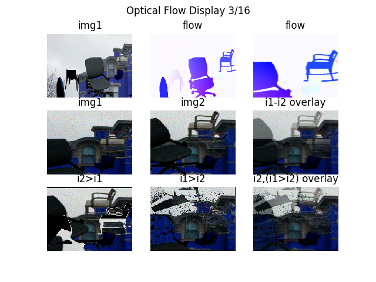
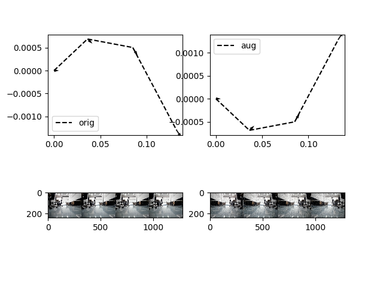
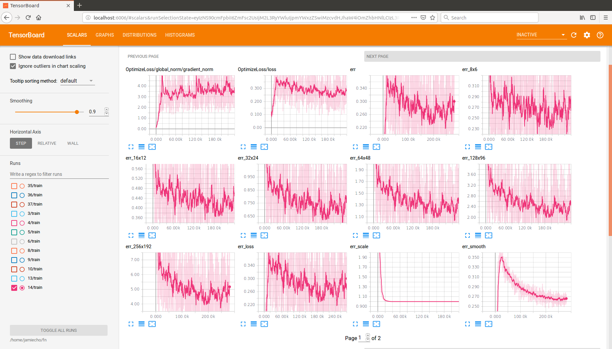
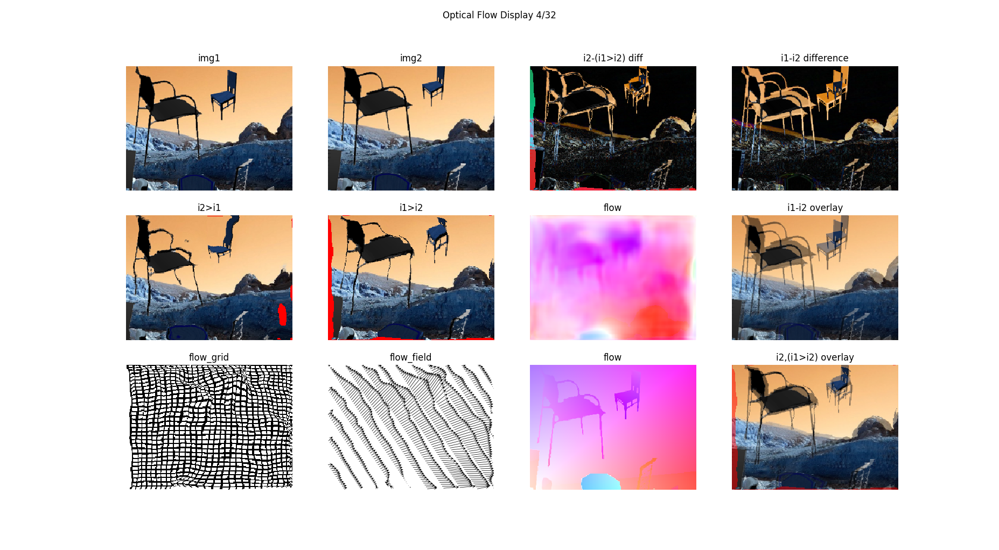
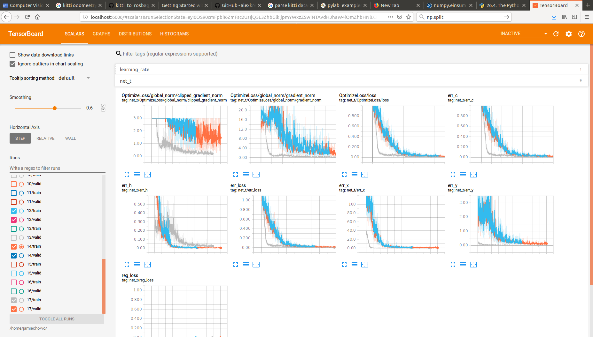
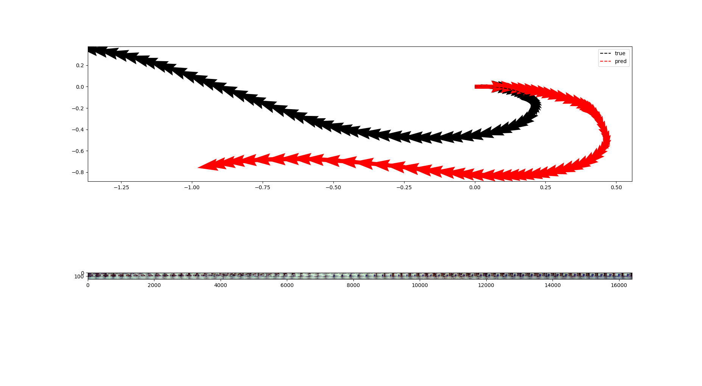

# Robot Learning Project

Yoonyoung (Jamie) Cho | CompRobo FA2018 @ Olin College

## Introduction

This project was a part of *Robot Learning* phase of *ENGR3950: A Computational Introduction to Robotics* at Olin College.

Accordingly, my objective here was to implement *monocular visual odometry*.

In traditional computer vision approaches, monocular visual odometry is considered a difficult problem: among the number of challenges, the lack of scale information renders the problem inherently under-constrained. Many authors have tackled this problem through approaches such as parallax-based scale estimation, ground-plane estimation with fixed camera heights, and more. Often, the problem will be worked around through employing additional sensors such as an IMU for visual-inertial odometry, or adding another camera to achieve stereo vision.

With the recent advances in deep learning, approaches such as [DeepVo](https://arxiv.org/abs/1709.08429) has demonstrated compelling performance on monocular visual odometry; in this exploration, I sought to evaluate both modern and classical approaches to familiarize myself with the algorithms, as well as the challenges along the way.

## Data

Throughout this project, multiple different datasets have been utilized at different stages of development. Here, each of them will be addressed and credited appropriately.

- **[KITTI Dataset](http://www.cvlibs.net/datasets/kitti/eval_odometry.php)** : The KITTI Visual Odometry dataset consists of 22 sequences of stereo-camera data, driving around in urban environments.
- **[ILSVRC Dataset](http://image-net.org/challenges/LSVRC/2015/index#vid)** This is a custom-generated large scale optical flow dataset based on the [ILSVRC](http://image-net.org/challenges/LSVRC/2015/index#vid) detection-from-video dataset, processed with a pre-trained [FlowNet](https://arxiv.org/abs/1504.06852) network.
- **[Academic Center Dataset]()** This is a custom-generated small-scale visual odometry dataset in the Olin College Academic Center with low-fidelity *"ground truth"* data from wheel encoder odometry, with images, timestamps and (for a subset) scans associated with each frame.
- **[Gazebo Dataset]()** This is a dataset generated through renders in the [Gazebo](http://gazebosim.org/)-simulated environment of the Olin College Oval, with randomly added objects for readily trackable visual features.
- **[Flying Chairs Dataset](https://lmb.informatik.uni-freiburg.de/resources/datasets/FlyingChairs.en.html)** : This is a somewhat "classical" dataset employed during the training of the original FlowNet architecture; the dataset consists of ground-truth optical flow associated with an artificially generated displacements of chairs on random background images extracted from Flickr.

The *classical* variant of the algorithm did not require training, and most of the validation was performed on the *Academic Center* dataset and *Gazebo* dataset.

The deep-learning approach of the algorithm was first trained on the optical flow images from a mixture of the *Flying Chairs* dataset and the *ILSVRC* dataset; afterwards, the weights from the flownet portion of the network was transferred to train the rest of the inference network for estimating visual odometry on the *KITTI* dataset. This network was then fine-tuned on the *Academic Center* dataset for scale adjustments.

Both the AC Dataset and the Gazebo Dataset have been generated with [data\_collector.py](scripts/data_collector.py), made available under ```scripts```.

### Data Augmentation

In the case of deep-learning based approaches, it is typical for classification or detection datasets to benefit from a large-scale dataset of millions of annotated images with high-quality labels. Such a dataset was not readily available, although a [compiled summary](https://github.com/youngguncho/awesome-slam-datasets) is available for the curious reader.

As the quantity of data was insufficient for either the optical-flow or visual-odometry tasks, it was imperative that existing data had to be augmented.

While such techniques must be used at caution in order to prevent the network from overfitting to augmented-style inputs, at validation the network did not exhibit significant overfitting behavior (at the final stage, at least).

In this particular case, the augmentation techniques were constrained by the following criteria:

- Augmentation for the images must be consistent across time, but may be different across batches.
- Augmentation for Optical Flow must account for any resizing artifacts on the source image on the flow as well, such that the flow-vector magnitude would be preserved.
- Augmentation for Visual Odometry could not employ any affine transforms on the image, such as cropping, would impact the relevant view-point of the camera.

Here are two samples of an image from the datasets, augmented for training the respective networks:

|||
|:---:|:---:|
|(a) Optical Flow Augmentation | (b) Visual Odometry Augmentation|

Note that in (a) the scale of the flow vector remains consistent through the cropping operation, and in (b) the spatial structure is preserved for both the reconstructed path and the image itself, so that the original information could be recovered despite the augmentation.

## Algorithms

### Classical

The *classical* algorithm was mostly an exploration with many of the available [OpenCV](https://opencv.org/) libraries and online tutorials, although none of the guides really solved the problem to the level of rigor that I had been hoping for. While many of the high-performing papers were reliant on global or semi-global optimization techniques including bundle adjustment, I didn't delve into the graph optimization portion too heavily on this project; I had planned on implementing the bulk of the critical pieces, and including SBA would have been a significant undertaking for the time being.

On a high level, the algorithm operates on a sparse set of feature points computed with detectors such as [ORB](http://www.willowgarage.com/sites/default/files/orb_final.pdf) and [Shi-Tomasi Detector](https://docs.opencv.org/3.0-beta/doc/py_tutorials/py_feature2d/py_shi_tomasi/py_shi_tomasi.html), whose keypoints are then converted into feature-vectors with the descriptors such as [BRISK](https://www.robots.ox.ac.uk/~vgg/rg/papers/brisk.pdf). These features points are tracked and matched across frames, whose correspondences allow for triangulation to jointly estimate the point's coordinate and the camera's relative poses across the frames.

The persistent tracking of landmarks allow for scale tranfer from an old to new set of landmarks, whereby the initial scale information is preserved across time. However, a frame-by-frame estimate of scale may be desirable, considering that significant drift is introduced for each frame in the PnP optimization process.

#### Results

||
|:---:|
| Fig.x. Classical Visual Odometry Demo |

In the animated demo, it is quite apparent that solving the PnP problem introduces errors in y-axis motion in case of rotation, which makes intuitively sense: if the detected landmarks are significantly and consistently far, then no relative displacement information will be available to estimate rotation.

The performance of the algorithm was highly sensitive to the input data and the parameters, which will be discussed more in depth in the following section.

#### Design Decisions

- UKF Parameter Tuning

In order to account for scenarios where the visaul odometry will abort due to insufficient number of features, the intermediate motion was smoothed and estimated through the Unscented Kalman Filter. The parameters have been determined in a somewhat arbitrary manner, where I just determined the scale based on qualitative observation of the VO algorithm itself, and how I wanted to scale between beliefs in motion versus the *"measurements"* that would be coming from the pipeline. Specifically:

|Param|x|y|&theta;|vx|vy|&omega;|
|:-:|:-:|:-:|:-:|:-:|:-:|:-:|
|P0|1e-6|1e-6|1e-6|1e-1|1e-1|1e-1|
|Q |1e-4|1e-4|1e-2|1e-1|1e-1|1e-1|
|R |1e-1|1e-1|1e-1|-   |-   |-   |

The relative scale and magnitude of these parameters represent the intuitive belief on the accuracy of the parameter.

For instance, the initial velocity is not known well, so the covariance starts with a large value in the velocity fields.

Similarly, it is expected that the vehicle may experience sudden change in its velocity during the course of its navigation;

the large variance matrix for measurement (R) represents the fact that visual odometry had not been very accurate throughout the experiments.

- Optical Flow filtering / detecting failures

Currently, the optical flow in computed through the sparse Lukas-Kanade algorithm on the feature points.

At "large" rotations that introduce large displacement in the image coordinates, the algorithm would fail on many of the correspondences.

In the current pipeline, such failures are filtered through the minimum eigenvalue computed at the corners, although the validity of this is questionable.

Moreover, the computed correspondences are likely to lie on approximately the same horizontal area, a constraint that is not reflected in the current algorithm.

While no significant efforts have been undertaken to solve this problem, a simple heuristic, as mentioned above, proved to be sufficiently accurate for the time being --

While it is unclear whether or not a higher quality optical flow estimates would improve the quality of visual odometry,

it is anticipated that the RANSAC filtering process down the pipeline would be robust enough against such outliers in the correspondences.

- Descriptor Match Tuning / Parameters

    The current implementation utilizes the [Flann](https://www.cs.ubc.ca/research/flann/) matcher implements a nearest-neighbor based search, and the resultant matches are afterwards filtered with the distance-based metric, as well as the canonical Lowe's ratio test with distance comparison with the second-best-match to identify matches of high likelihood of correspondence (unique). Whereas many of the parameters have been following the general suggested parameters, this is definitely subject to exploration (especially for the distance threshold).
    
- Corner Sub-Pixel Alignment

    At Early stage of the development, the reconstructed landmarks exhibited strange behavior where the depth of each point in the point-cloud would appear to be discrete. One hypothesis on this was that the feature points were detected at a pixel-point resolution, which would give a fixed, discrete increments for disparity across correlation. As such, one experiment that was implemented was to adjust the detected corner features such that it would be closer to the "true" corner location, allowing for sub-pixel accuracy for where the pixel might be.
    
- Landmark PnP Coordinate Frame - Oldest vs Newest

    At the beginning of the pipeline, where frame-by-frame matching was implemented, the landmarks and the motion vector were always computed with respected to the projection matrix of the penultimate observation. This had the benefit of filtering out erroneous y-directional translation that often gets introduced as a result of incorrect regression for the transformations (with the no-slip assumption), but had the landmarks' positions dynamically changing throughout the course of the run. As this may have introduced significant instabilities with accumulating pose error, the architecture was altered to compute landmark positions from the origin coordinates instead.
    
- Re-initialization thresholds

    This is still very much experimental, and highly dependent on the operating environment. In the current pipeline, the only mechanism by which the current tracking status is evaluated is by observing the number of keypoints (landmarks) that are currently being tracked by the pipeline. At this stage, the complete re-initialization threshold is set to be 100 landmark points, which builds soem stability around the scale estimation drift over time with the persistent tracking scheme as described previously; however, too frequent of initialization completely corrupts the scale/motion information, which is an area of concern.
    
- Landmark incremental updates and smoothing

    As the first introduction of the landmarks in the scene may be subject to incorrect triangulation or inaccurate estimate of pose at the particular frame, one simple strategy that was employed was to re-detect such landmarks and smooth their position over time, while also adding new landmarks dynamically. This drastically reduced the catastrophical failures of the algorithm, while the quality of the output did not exactly improve significantly.
    
- Frame-by-frame landmark registration

    The current scheme compares the landmarks in a largely frame-to-map manner; the algorithm may perform better if correspondences across local neighboring frames are also established, but this is just a speculation at this point.
    
- Using Extrinsic Guess for RANSAC from UKF

    The extrapolated UKF estimates at the current position is used as the seed for the RANSAC PnP Solution; it is unclear whether or not this increases the quality of the algorithm. Based on qualitative observation, this is not the case, but it may potentially benefit from this extra information in general: at least in terms of avoiding drastic outliers.
    
- Choice of PnP Algorithm

    There exist a wide range of particular flavors of the PnP algorithm used in the OpenCV Implementation; some options are *EPNP, DLS, AP3P, ITERATIVE, P3P, UPNP*. Not all of these parameters have been evaluated, but the current algorithm of choice is DLS.
    
- Image Resolution

    Higher image resolution allows for better triangulation information with what would otherwise be sub-pixel level information, at the cost of longer processing time; this is an area that was not explored to too much detail, but as the pipeline begins to consider optimization, this is definitely an area to look into.

#### Challenges and Next Steps

Scale Estimation

|||
|:---:|:---:|
|(a) Optical Flow Training Plot | (b) Optical Flow Sample Result|

As anticipated, robust scale estimation and the drift across time turned out to be the most challenging portion of monocular VO.

As seen on the above figure, the performance difference is dramatic when only the ground-truth scale information is supplied to the algorithm:

The computed pose is a lot more robust, and the estimated landmark points are a lot more stable.

(Note that the demo in the [results](#Results) section was taken without ground truth scale information, showcasing the algorithm may achieve moderate success in the case where landmark scale drift is not significant.)

As such, some of the options that are considered next steps are:

- Groundplane scale estimation
    
    This was not attempted in this development cycle, as neither the AC nor the Gazebo datasets produced rich feature points on the ground-image for robust and reliable tracking to serve as landmarks; however, it is entirely possible that this would be a compelling solution for general use-case scenarios.
    
- Parallax scale estimation

    Relative z-directional distance of landmarks may be estimated with the use of vanishing points and parallax features, which may help rectify the landmarks scaling problem in a frame-to-frame manner.

- Visual-Inertial Odometry

    In order to parallel the conditions of the DL-approach, the algorithm did not take advantage of the onboard accelerometer, which may help mitigate the scale drift.

Other next steps include the following improvements:

- Feature Points Uniform Distribution

    Currently, the feature points are concentrated in regions of "high interest" for the keypoint detector. However, the algorithm would certainly benefit from a smooth incremental change in the tracked feature-points, as well as a more uniform distribution of landmarks throughout the view image in order to enforce constraints on all axes. As such, it is desirable to employ some heuristic in order to have the feature points distribute throughout the image, rather than few regions of interest.
     
- Graph Optimization / Bundle Adjustment Steps

    At some point, the robust and reliable pose estimation across time would require bundle adjustment -- simultaneously optimizing for the camera pose transforms and the landmark locations. The current strategy is simplistic in that the landmarks would be updated with the interpolated position across time, which is highly unstable, and no real effort has been done to incorporate the confidence estimates (represented either as the covariance matrix or the fisher information) of each tracked feature: whether it be the landmarks or the camera pose.
    
### Deep-Learning

The *deep-learning* algorithm was heavily inspired by the [DeepVo](https://arxiv.org/abs/1709.08429) paper, although no "working" implementation was available online as far as I was aware of. Many of the network hyper-parameters and the training configurations were modified to suit for the particular use-case: the images were heavily downsized, and the network made heavy use of Separable Convolution and Batch Normalization where appropriate, unlike the original architecture.

In particular, the network architecture consists of an initial CNN(Convolution Neural Network) portion to produce condensed feature-vector representations, which are then fed through the RNN(Recurrent Neural Network) with stacked LSTM(Long Short-Term Memory) Cells to produce the final representation of 512 floating-point numbers, which are then connected with a series of zero-bias fully connected layers to produce the frame-by-frame translation and rotation in SE2 (for simplicity).

As for the optical-flow network, the net started with the identical CNN layer whose output was processed through cross-correlation across time-steps. This "merged" feature was then processed with the successive part of the network that formed a somewhat hourglass-like construction with [up-convolution]() layers to build up a pyramid of dense optical flow vector fields at each scale, which were all concatenated and convolved iteratively to produce the final full-sized optical flow output. 

#### Results

|||
|:---:|:---:|
|(a) Optical Flow Training Plot | (b) Optical Flow Sample Result|


|||
|:---:|:---:|
|(a) Visual Odometry Training Plot | (b) Visual Odometry Sample Result|

#### Design Decisions

- Two-dimensional space constraint

    While a real ground-rover may have full 6DoF pose specification in order to account for possible pitch and roll variations, as well as non-euclidean global surface geometry, I enforced a heavy two-dimensional constraint where the robot's pose was a 3DoF representation (x,y,heading). This was partly to reduce the complexity of the algorithm, and partly to reduce the possible state-space for the algorithm to explore. It certainly worked around rotation-vector encodings and other potential instabilities in the algorithm.
    
- Downsize

    The network as a whole operated on a smaller image size than the reported paper; while this decision may have impacted the performance negatively, I believed (and still do) that for such an aggressively reduced problem, the network did not have to be large. Indeed, I saw significant overfitting behavior on the algorithm, meaning that the network could sufficiently encode the relationships, and had to incorporate a fair amount of regularization schemes to avoid the issue.
    
- Separable Convolution
    Partly as an effort to improve the speed and memory bandwidth of the network, all convolutional layers have been replaced with separable convolution.
    
- Batch Norm

    Similarly, a very standard approach on training networks reliably is to incorporate batch normalization to satisfy the general zero-mean unit-variance input assumption for the network. The caution here is not to apply batch normalization on the output layers, which are required to always be zero-bias.

- Dropout

    This was a very standard way to reduce events of overfitting; on a high level, only a subset of the features are utilized to compute the final inference result, which builds in some degree of redundancy and independence across different features.
    
- L2 Regularization

    This was also a very standard way to reduce events of overfitting, by constraining the "complexity" of the weights to remain within a certain practical domain by penalizing the scale of the weights.
    
- Up-Convolution

    This was for the optical flow network. Part of the decision for implementing up-convolution stemmed from the fact that there exist no implementation of separable, transposed convolution in Tensorflow yet. For performance consideration, it was desirable to use the up-convolution scheme, where the previous layer is up-sampled and a standard convolution is applied henceforth. This also reduced the strided artifacts commonly seen (and were indeed seen) in the final flow image.

- Dynamic weight decay for multi-objective networks

    This was a somewhat exploratory approach to balance the target function throughout the training duration for multi-objective networks; in particular, the network would compute the flow fields at each pyramidal representation, and the initial network would solve the *"easier"* problem of determining the mean flow vector across a larger receptive field. Later, the metric that are actually of interest to the final representation (such as the full-scale flow field inference) would come to a higher priority through dynamically adjusting the relative weights. While the first implementation of this improved the results somewhat, there was not much variability within the parameters within the scaling scheme.
    
- Cyclic Learning Rate Decay

    This was a very exploratory approach to adjust the learning rate in a *cyclic* manner (i.e. a clamped decaying sinusoid), such that the learning rate would be slowly shifted up and down across the training duration. The idea was that this would potentially help between resolving the requirements for exploration (to not to settle for local minima) and optimization to a "narrow" and unforgiving minima. Unfortunately, no significant improvement was observed after implementing the scheme.
    
- Learning Initial "Ramp"

    The original FlowNet paper also implemented this strategy to combat instabilities for their FlowNet-C architecture; accordingly, the learning rate would actually start at a much smaller value than the typical initial learning rate would be, then gradually ramp up to the desired learning rate to prevent exploding network gradients in the first few training iterations.
    
- VO SE2 Weight Scaling

    Each of the 3DoF pose (x,y,heading) produce errors, and the weight scaling must be applied accordingly such that no one error dominates over others. In order to achieve this, a metric similar to mahalanobis-distance was implemented, where an estimate of the standard deviation of the dataset were used as the inverse scaling factor for the respective computed errors.
    
- Freezing vs fine-tuning pre-trained weights

    At this point, it is unclear whether or not freezing the pre-trained weights or propagating gradients to the earlier layers at any point in the dual transfer-learning scheme in the current network architecture would improve the performance; no experiments have shown conclusive results on dramatic improvements as a result of either strategy.
    
#### Challenges and Next Steps

Similarly to the classical scheme, a significant challenge on the monocular visual odometry network was scale estimation, on both the translation and rotational parts. Namely, the network had difficulty tracking the pose of the camera across long durations (>16 frames).

A natural next step would be a further dive into the hyperparameters, but at some point exploration into varying network sizes and parameters in the architecture was hitting diminishing returns per effort; as the development timeline of the project was stretched quite thin already, it was also important to acknowledge that the exhaustive parameter search process was (quite appropriately) very exhausting.

Another possible direction of exploration would have been to incorporate extrinsic sensors, such as the IMU(accelerometer), Wheel encoder or the LIDAR data to assist the algorithm in making sense of the environment, but this would have required significant investment of time into the mixture and resolution of heterogeneous input data in a single network, which was intractable given the hard time and labor constraints.

## Conclusion

In general, I have learned about the problem of monocular visual odometry at depth; at heart, the problem itself is underconstrained in that there exist no "true" mathematical formulation that would provide deterministic estimate about the motion scale in an accurate and robust manner; in a way, the information is simply not there without incorporating external knowledge such as estimate of the scene geometry or classification of known multi-dimensional objects in the receptive field of view.

In some ways, there is no "good" solution to the problem that addresses such issues in a simple and robust manner; as such, the problem was quite open-ended which brought its own issues. In this particular case, the development cycle was extending far beyond the scope of the project, and the management of such a timeline did not happen in an effective manner, which is an area to work on: mitigating the risks in the development process and managing the risks by identifying areas of high priority and high effort/time requirements.

Finally, I'd like to express my appreciation for the patience of Paul Ruvolo, as he kindly waited (quite long) for the project to reach some degree of termination.
